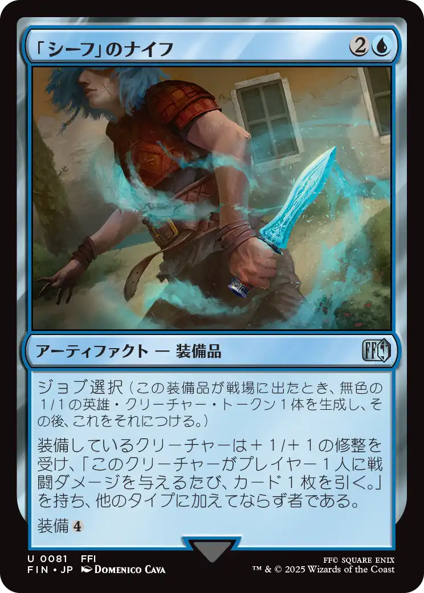
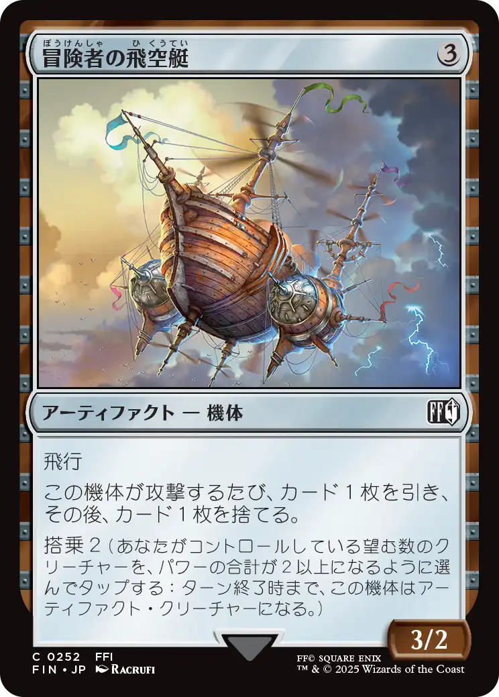

  <label>シリーズ:
    <select id="filter-series" onchange="filterSections()">
      <option value="">すべて</option>
      <option value="1">1</option>
    </select>
  </label>
  <label>色:
    <select id="filter-color" onchange="filterSections()">
      <option value="">すべて</option>
      <option value="白">白</option>
      <option value="青">青</option>
      <option value="黒">黒</option>
      <option value="赤">赤</option>
      <option value="緑">緑</option>
      <option value="マルチカラー">マルチカラー</option>
      <option value="無色">無色</option>
      <option value="アーティファクト">アーティファクト</option>
      <option value="土地">土地</option>
    </select>
  </label>
  <label>タイプ:
    <select id="filter-type" onchange="filterSections()">
      <option value="">すべて</option>
      <option value="クリーチャー">クリーチャー</option>
      <option value="アーティファクト">アーティファクト</option>
      <option value="紋章">紋章</option>
      <option value="インスタント">インスタント</option>
      <option value="ソーサリー">ソーサリー</option>
      <option value="エンチャント">エンチャント</option>
      <option value="土地">土地</option>
    </select>
  </label>

  
「戦士」の剣

  

    
  

  
「戦士」の剣

  

  
「白魔術士」の杖

  

    
  

  
「白魔術士」の杖

  

  
「黒魔術士」の杖

  

    
  

  
「黒魔術士」の杖

  

  
「シーフ」のナイフ

  

    
  

  
「シーフ」のナイフ

  

  
「モンク」の拳

  

    
  

  
「モンク」の拳

  

  
「赤魔術士」のレイピア

  

    
  

  
「赤魔術士」のレイピア

  

  
冒険者の飛空艇

  

    
  

  
冒険者の飛空艇

  

  
グルグ火山の赤竜(エインシャント・カッパー・ドラゴン)

  

    
  

  
グルグ火山の赤竜(エインシャント・カッパー・ドラゴン)

  

  
コーネリアの騎士、ガーランド

  

    
    <button type="button" onclick="toggleImage(this)">切り替え</button>
  

  
コーネリアの騎士、ガーランド

  

  
セーラ姫(迷える探求者、梓)

  

    
  

  
セーラ姫(迷える探求者、梓)

  

  
フェニックスの尾

  

    
  

  
フェニックスの尾

  

  
ワールドマップ

  

    
  

  
ワールドマップ

  

  
光の一閃

  

    
  

  
光の一閃

  

  
光の戦士(統べるもの、ジョダー)

  

    
  

  
光の戦士(統べるもの、ジョダー)

  

  
始まりの町

  

    
  

  
始まりの町

  

  
宝物

  

    
  

  
宝物

  

  
宝物(モーグリ)

  

    
  

  
宝物(モーグリ)

  

  
宝物(手掛かり)

  

    
  

  
宝物(手掛かり)

  

  
山

  

    
  

  
山

  

  
町の歓迎者

  

    
  

  
町の歓迎者

  

  
雲海の魔人(ニクス咲きの古きもの)

  

    
  

  
雲海の魔人(ニクス咲きの古きもの)

  

